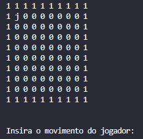
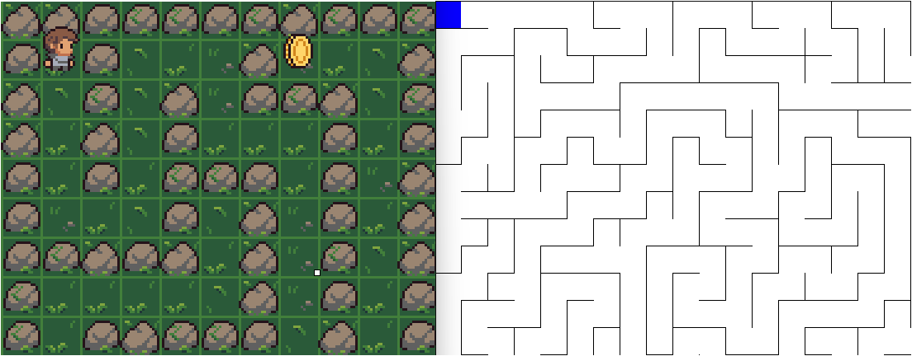
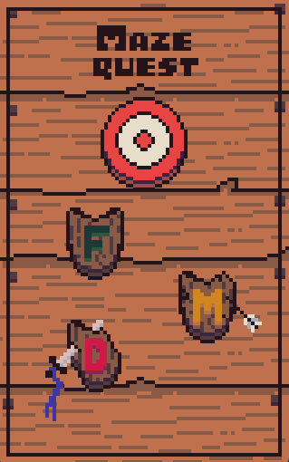

# Processamento de Voz 23.1

Alunos:
- Andrés 
- Diogo Lima
- Rebeca

## Sumário
- [Ideia Inicial](#ideia-inicial)
- [Construção](#construção)
- [Conclusão](#conclusão)

## Ideia Inicial
A proposta do trabalho era desenvolver qualquer sistema que se utilizasse de processamento de voz em seu funcionamento. A abordagem inicial é desenvolver um jogo que fosse simples e que tivesse como forma de interação comandos de voz em tempo real.

## Construção
O software foi desenvolvido em `Python3` e pode ser dividido em quatro etapas, desenvolvidas respectivamente:
- [Jogabilidade](#jogabilidade)
- [Interface](#interface)
- [Labirinto](#labirinto)
- [Microfone](#microfone)

### Jogabilidade
Inicialmente, o Jogo foi pensado como um tabuleiro, onde o jogador poderia se movimentar pelos espaços vazios para todas as direções. Pensando nisso, foram desenvolvidas classes, `Mapa` e `Jogador`, que armazenam o estado de cada um dos espaços vazios e a posição do personagem nesse tabuleiro.

Como representação gráfica inicial, o mapa foi representado como um array de $n \times m$, onde o jogador foi representado como a letra $j$, e podia se movimentar livremente pelo mapa utilizando os comandos especificados ("direita", "esquerda", "cima" e "baixo")

Onde os espaços vazios são representados por $0$ e as paredes por $1$.

### Interface
Para possibilitar a visualização do jogo, foi desenvolvido no framework `tkinter` (nativo do `Python3`) a interface principal, onde o jogador, os espaços vazios e os obstáculos passariam a ter representações gráficas externas ao terminal.

Foi utilizado o Software `Aseprite` para o desenvolvimento de cada um dos elementos, que pode ser encontrado na pasta `assets` desse projeto.

   

     

   

Nesta etapa do desenvolvimento, os inputs de movimentação ainda ocorrem via teclado.

### Labirinto
Para adicionar um grau a mais de complexidade para o jogo, foi implementado um algoritmo capaz de gerar labirintos, `DFS` (Depth-First Search), onde ao iniciar o jogo e definir o tamanho do mapa... Um novo labirinto é gerado randomicamente, fazendo cada jogo único.

O algoritmo teve de ser modificado em uma série de aspectos, uma vez que o mesmo é focado em desenvolver labirintos onde as paredes são unidimensionais. Porém, uma vez estabelhecida a temática de tabuleiro, os obstáculos devem ocupar uma casa inteira, e não apenas uma aresta de uma casa, como observado abaixo.

### Microfone
Agora que as funcionalidades do jogo já foram estabelhecidas, a próxima etapa seria coletar dados do microfone em tempo real.

Para isso, foi implementada inicialmente a biblioteca de `speech_recognition`, que utiliza api's online para detecção de frases. Porém, existem alguns aspectos negativos dessa biblioteca. Primeiramente, o software passaria a ser 100% dependente de internet, além disso, a biblioteca tem um tempo de resposta muito alto, uma vez que ela apenas verifica o que está sendo dito nos intervalos de silêncio, portanto, não realiza nenhuma detecção se a fala for contínua.

Pensando nisso, evoluimos o software para comportar reconhecimentos offline e de espaços de aproximadamente 1 segundo com o `DTW`. Dessa forma, mesmo no meio da fala, quando uma palavra-chave é dita, a resposta é quase imediata. A implementação foi feita coletando o audio do microfone em blocos, utilizando as bibliotecas `pyaudio` e `librosa`, onde extraimos os coeficientes mel-cepstrais e os comparamos com as das amostras de treino coletar os comandos vocais.

## Conclusão
Por fim, foi desenvolvido um Menu, onde o jogador pode treinar os comandos com a sua voz e escolher a dificuldade de seu jogo (Fácil, Médio ou Difícil).

Após o treino, o Jogador pode selecionar qualquer um dos escudos e iniciar o jogo com um labirinto diferente todas as vezes.